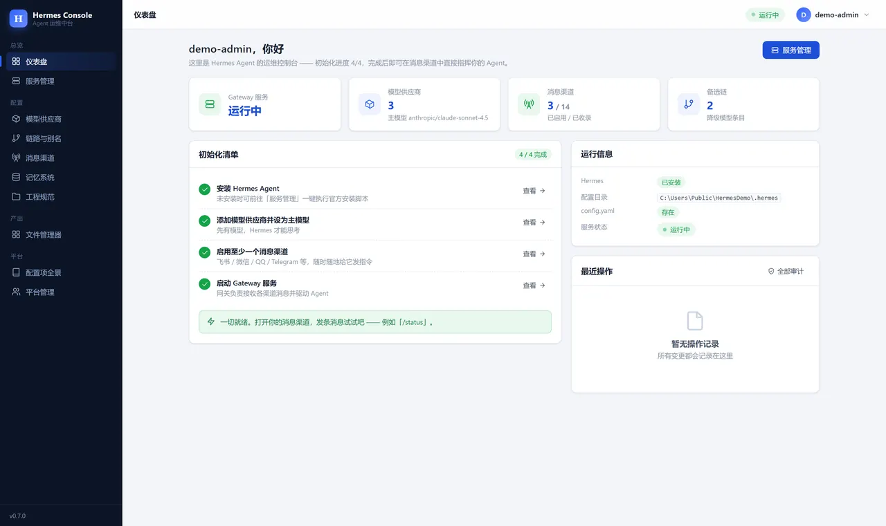
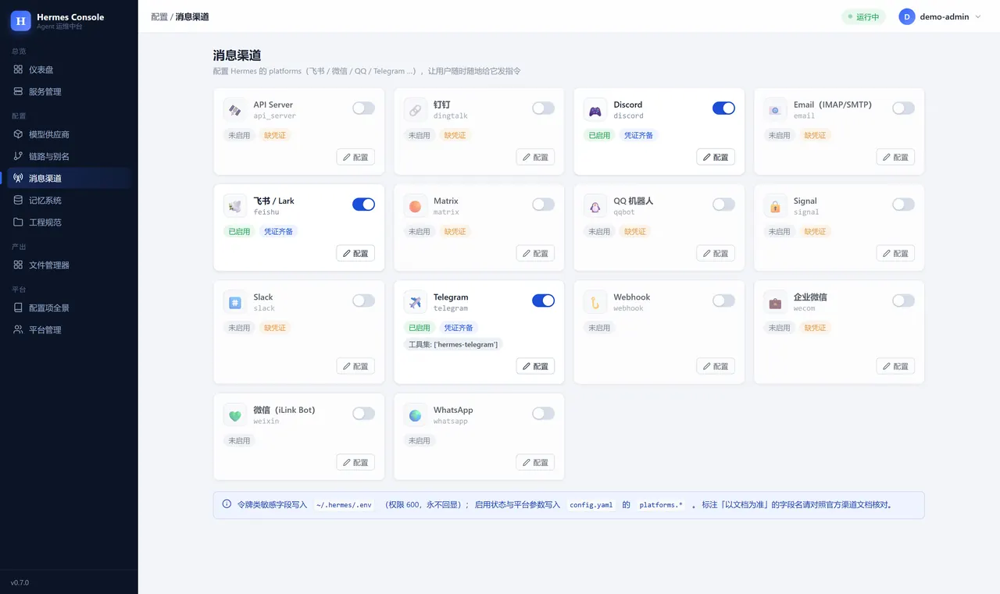

# Hermes Console

[](https://github.com/rexleimo/hermes-setup/actions/workflows/ci.yml)


Hermes Agent 的可视化运维中台 —— 让 [Hermes Agent](https://github.com/NousResearch/hermes-agent)
不再需要 SSH：安装、启动 Gateway、配置模型供应商与消息渠道，全部在一个**严格鉴权**的 Web 控制台完成。

> 技术栈：Python 3.11+ · uv · FastAPI · Jinja2 · HTMX · SQLite。
> 无前端构建步骤，静态资源本地化，可部署在内网隔离环境。

**这份 README 就是本项目唯一的对外首页。** 文档正文直接在 GitHub 上点开看（Markdown 原生渲染）；
不再单独维护官网或文档站 —— 原 `site/` 单页与 GitHub Pages 部署已在 v0.7.1 退役。

## 入口

| 入口 | 地址 |
|---|---|
| 💻 仓库 / 首页 | <https://github.com/rexleimo/hermes-setup>（即本页） |
| 📄 文档 | 本页「文档」一节 + [`docs/`](docs/) 目录 |
| 🐛 问题反馈 | <https://github.com/rexleimo/hermes-setup/issues> |
| 🔒 漏洞报告 | 见 [docs/SECURITY.md](docs/SECURITY.md)，走私有通道，**勿开公开 Issue** |
| ⬆️ 上游项目 | [Hermes Agent](https://github.com/NousResearch/hermes-agent)（NousResearch） |

## 界面

仪表盘：Gateway 运行状态、供应商与渠道概览、待办引导。



消息渠道：14 个渠道卡片墙，令牌只写 `.env` 且永不回显。



> 截图来自**隔离的演示实例**（合成数据、独立的 `HERMES_CONSOLE_DATA` 与 `HERMES_HOME`），
> 不含任何真实机器的路径、账号或密钥。重拍方式见 [docs/SCREENSHOTS.md](docs/SCREENSHOTS.md)。

## 功能总览

| 模块 | 能力 |
|---|---|
| **初始化与服务管理** | 一键执行官方安装脚本 / `hermes update`；Gateway（server 服务）启动、停止、重启；状态三路探测（CLI / gateway_state.json / 日志新鲜度）；gateway.log 与 errors.log 实时查看；后台任务执行与输出轮询 |
| **模型供应商管理** | 类 CC Switch 的 CRUD；五种 API 协议模式（OpenAI Chat 兼容 / OpenAI Responses / Anthropic Messages / AWS Bedrock / Google Gemini）；13 个官方预设供应商一键添加；在线拉取模型列表并逐个登记（模型 ID / 显示名称 / 上下文长度）；一键连接测试 |
| **链路与别名** | 主模型切换（`model.*`）；降级备选链可视化排序（`delegation.fallback_providers`）；模型别名管理（`model_aliases`） |
| **消息渠道** | 14 个渠道（飞书 / 微信 / QQ / Telegram / 企业微信 / 钉钉 / Discord / Slack / Email / WhatsApp / Signal / Matrix / Webhook / API Server）卡片式管理；令牌写入 `.env`（600 权限、永不回显）；平台参数写入 `config.yaml` 的 `platforms.*`；每渠道工具集覆盖（`platform_toolsets`） |
| **记忆系统** | 内置记忆容量调优（默认 2,200/1,375 字符 → 一键预设至 16,000/8,000，解决大项目记忆写满报错）；9 家外置记忆方案一键切换并自动写入配置：社区 AgentMemory（零代码 MCP / Provider 插件自动安装）、Mem0、Supermemory、OpenViking、Hindsight、Holographic、RetainDB、ByteRover、Honcho |
| **MCP 服务** | `mcp_servers.*` 的 CRUD 与启停：stdio（command/args/env）与远程 HTTP/SSE（url/headers/OAuth）两类；信任分级（untrusted = 写操作走审批）；密钥只写 `.env` 并以 `${VAR}` 占位符引用；官方热门目录（optional-mcps，64 个 Nous 审核条目）一键添加 |
| **技能管理** | `~/.hermes/skills/` 目录可视化（SKILL.md frontmatter 解析）；启停写入 `skills.disabled`（官方必备技能 `hermes-agent` 不可禁用）；官方热门技能库（optional-skills，24 类）一键安装；`skills.*` 配置域表单（外部目录 / 项目信任 / inline_shell / 安全扫描） |
| **插件与 Hook** | Python 插件白名单启停（`plugins.enabled`，官方信任模型：默认禁用）+ 官方策展目录安装（走官方 CLI 后台任务，sha 锁定交给官方校验）；shell hooks CRUD（`hooks.<event>[]`，校验对齐官方：matcher 仅工具事件、fail_closed 仅 pre_tool_call、timeout ≤ 300）；信任白名单撤销；gateway hooks / outbound webhooks 只读盘点（机制调研见 [docs/PLUGINS_AND_HOOKS.md](docs/PLUGINS_AND_HOOKS.md)） |
| **工程规范** | 参考 AIOS 的工程化约束层：工作区目录规范（projects/downloads/scratch/archive）+ 六条工程铁律 + 需求消化模板，通过 SOUL.md 托管块（幂等、不碰用户自有内容）、3 个官方格式技能（project-init / requirement-digest / file-placement）与 `agent.coding_instructions` 注入；支持工作区一键物理初始化与整体卸载（见 [docs/ENGINEERING_SPEC.md](docs/ENGINEERING_SPEC.md)） |
| **配置项全景** | 对 Hermes 全部配置域的盘点与集成建议（已集成 / 建议二期 / 待评估 / 建议手改），作为后续迭代的评审入口 |
| **安全与审计** | 详见下文「安全」与 [docs/SECURITY.md](docs/SECURITY.md)（面向部署者的加固清单） |

## 快速开始

**小白用户：不用敲命令 —— Windows 双击 `start.bat`；macOS 打开「终端」，把 `start.sh` 拖进终端窗口按回车。
首次会自动装依赖、启动后自动打开浏览器；关窗口即停止。**

> **Windows 弹出「Windows 已保护你的电脑」？** 系统对未签名脚本的常规拦截，不是病毒：
> 点「更多信息」→「仍要运行」。杀毒软件拦截同理，选「允许」。
>
> **安装卡住或报网络错误？** 装依赖需要访问 GitHub / PyPI，国内网络建议开代理；
> 启动脚本失败时会显示中文提示与镜像重试办法，照着做即可。进入控制台后，
> 侧栏「运行体检」页可逐项检查网络与本机环境。

<details>
<summary>手动启动（开发者 / 自定义端口）</summary>

```bash
# 1. 安装依赖（自动创建虚拟环境）
uv sync

# 2. 配置环境变量（可选；不配置则使用安全默认值）
cp .env.example .env
# 编辑 .env，务必设置 HERMES_CONSOLE_SECRET：
# python -c "import secrets; print(secrets.token_urlsafe(48))"

# 3. 启动
uv run uvicorn app.main:app --host 127.0.0.1 --port 8420

# 4. 打开 http://127.0.0.1:8420 —— 首次访问进入管理员初始化向导
```

</details>

首次部署建议流程（控制台内的「初始化清单」会引导这四步）：

1. **服务管理 → 一键安装** Hermes Agent（官方 install.sh）；
2. **模型供应商 → 添加预设**（如 OpenRouter / GLM / Kimi）→ 拉取模型列表 → 设为主模型；
3. **消息渠道 → 飞书**，填入 App ID / App Secret 并启用；
4. **服务管理 → 启动 Gateway**。

生产部署：用 systemd 托管 uvicorn，前置 Nginx/Caddy 做 HTTPS（开启 `HERMES_CONSOLE_SECURE_COOKIES=1`），
并用 `HERMES_CONSOLE_ALLOWED_IPS` 限制管理来源。

## 升级与卸载

**你的数据与代码是分离的。** 管理员账号、审计日志、配置备份都在**控制台数据目录**：

- 全新安装：`~/.hermes-console`（默认；重装/替换项目目录不影响它）；
- 旧版本（v0.8 及更早）升级而来：项目目录内的 `data/`（检测到会自动沿用）；
- 显式指定：环境变量 `HERMES_CONSOLE_DATA`。

**升级** = 关掉控制台 → 用新版替换代码目录（**不要删除数据目录**）→ 重新启动；`git pull` 同理。
数据目录的实际位置见控制台「平台管理 → 系统设置 → 配置文件位置」。

**卸载** = ① 关掉控制台；② 删项目目录；③ 删控制台数据目录（见上）；
④ 不再用 Hermes Agent 的话，再删 `~/.hermes`（Agent 配置、日志、技能都在其中）。

忘记管理员密码：项目目录里 Windows 双击 `reset-password.bat`，macOS/Linux 运行
`bash scripts/reset_password.sh`，按提示重置后用新密码登录。

更多排查（端口占用、发消息不回复、恢复备份等）见控制台侧栏底部 **「帮助与常见问题」** 页。

## 运行测试

```bash
uv run pytest          # 全量回归：认证 / CSRF / 限流 / 配置读写 / 进程管理 / 页面渲染（150+ 用例）
```

## 目录结构

```
app/
├── main.py                 # 应用工厂：中间件栈（安全头→IP白名单→会话）+ 异常处理
├── core/                   # 平台自身
│   ├── settings.py         #   env 配置（导入期只读单例）
│   ├── db.py               #   SQLite（WAL）与全部建表
│   ├── security.py         #   Argon2 密码、TOTP、HMAC 签名令牌
│   ├── sessions.py         #   服务端会话（绝对+空闲双过期）
│   ├── csrf.py             #   CSRF 令牌
│   ├── ratelimit.py        #   登录限流与账号锁定
│   ├── audit.py            #   审计日志（仅追加）
│   └── appsettings.py      #   运行时设置与用户管理
├── hermes/                 # Hermes 适配层（对底层操作的全部收敛点）
│   ├── paths.py            #   ~/.hermes 目录与二进制探测
│   ├── schema.py           #   协议/预设/渠道字段的 UI 描述符
│   ├── config_store.py     #   config.yaml（保注释 round-trip）与 .env 的原子读写
│   ├── providers_service.py#   供应商/主模型/别名/备选链 → Hermes 配置的映射
│   ├── channels_service.py #   platforms.* / .env / platform_toolsets 的写入
│   ├── mcp_service.py      #   mcp_servers.* CRUD + 官方 optional-mcps 目录
│   ├── skills_service.py   #   skills/ 目录可视化 + 官方 optional-skills 库 + skills 域
│   ├── plugins_service.py  #   插件白名单 + plugin-catalog + 官方 CLI 安装
│   ├── hooks_service.py    #   shell hooks CRUD + 信任白名单 + gateway hooks 盘点
│   ├── supervisor.py       #   hermes gateway 进程控制与状态
│   ├── installer.py        #   安装/更新后台任务
│   └── model_catalog.py    #   各协议 list-models 拉取
└── web/
    ├── deps.py             # 认证守卫（异常式短路）与路由级 CSRF
    ├── routers/            # auth/dashboard/service/diagnose/providers/channels/chains/memory/engineering/mcp/skills/plugins/files/audit/users/settings/catalog/help
    ├── catalog_data.py     # 配置项全景数据（UI 与文档共用）
    ├── templates/          # Jinja2 模板 + 宏
    └── static/             # 设计系统 CSS / 交互 JS / 本地化 htmx
docs/
├── SECURITY.md             # 面向部署者的安全说明与加固清单（对外）
├── ARCHITECTURE.md         # 架构与设计决策（工程）
├── CONFIG_CATALOG.md       # Hermes 配置项深挖清单（二期排期入口）
├── PLUGINS_AND_HOOKS.md    # 插件与 Hook 机制调研（四套 Hook + 插件信任模型）
├── ENGINEERING_SPEC.md     # 工程规范层设计（Agent OS 式约束）
├── CHANNEL_ONBOARDING_SPEC.md  # 全渠道接入助手设计
├── FILE_WORKBENCH_SPEC.md  # 文件管理器规格（W3-W5）
├── RUST_ASSESSMENT.md      # 「底层操作是否该用 Rust」的评估结论
├── SCREENSHOTS.md          # README 截图的重拍方法
├── assets/                 # README 用图（WebP，压缩后入库）
└── dev/                    # 工程内部文档（威胁模型等，不在首页/UI 链接）
.github/workflows/
└── ci.yml                  # push/PR 跑 pytest（ubuntu + windows）
shots/                      # 截图原图（gitignore，不入库）
```

## 对外入口策略（为什么没有文档站）

- **唯一首页 = 本 README**。GitHub 自带 Markdown 渲染、自带图片、自带 Issue，够用且零维护。
- **工程文档留在 `docs/`**，从 README 点进去；`docs/dev/` 是内部工程文档，
  不在首页与产品界面里链接（原因见 [docs/dev/THREAT_MODEL.md](docs/dev/THREAT_MODEL.md) 末尾「对外表述纪律」）。
- **不再自建文档站**：v0.7.1 起 `site/` 与 `deploy-site.yml` 已删除，GitHub Pages 未启用。
  曾经写过的 `rexai.top` 已不再指向本项目，不要再引用。
- 若将来确实需要静态站（例如做交互式教程），再单独评审，不要提前维护。

## 对 Hermes 配置的写入契约

平台**只写 Hermes 官方 schema 认可的键**，且遵循官方推荐的安全实践：

- API Key 本体只写 `~/.hermes/.env`，`config.yaml` 中仅存 `key_env` 键名；
- 自定义供应商 → `providers.<id>: {base_url, api_mode, key_env}`；
- 主模型 → `model.{provider, default, base_url, api_mode, context_length}`；
- 别名 → `model_aliases.<alias>: {model, provider, base_url?, key_env?}`；
- 备选链 → `delegation.fallback_providers: [{provider, model, ...}]`；
- 渠道 → `platforms.<name>.{enabled, extra}` + `.env` 令牌键 + `platform_toolsets.<name>`；
- MCP → `mcp_servers.<name>`（stdio / http(sse) / enabled / timeout / trust / auth），
  密钥类 env 与 header 只写 `.env`，配置中以 `${VAR}` 占位符引用（官方连接期解析）；
- 技能 → 启停写 `skills.disabled`，安装即复制目录进 `~/.hermes/skills/`（与官方
  `hermes skills install` 等效）；插件 → 增删 `plugins.enabled` 白名单；
- shell hooks → `hooks.<event>[].{command, matcher?, timeout?, fail_closed?}`，
  校验规则与官方一致（matcher 仅工具事件、fail_closed 仅 pre_tool_call、timeout ≤ 300）。

所有写入均为「备份 → 校验 → 临时文件 → 原子替换」，`config.yaml` 的注释通过
ruamel.yaml round-trip 完整保留，备份保留最近 10 份（`config.yaml.bak-*`）。

## 文档

**给使用者**

- [安全说明](docs/SECURITY.md) — 平台内置防护 + 首次部署加固清单 + 漏洞报告渠道
- [工程规范层](docs/ENGINEERING_SPEC.md) — 工作区目录规范与六条工程铁律
- [截图重拍方法](docs/SCREENSHOTS.md) — 如何在不泄露真实环境的前提下更新本页配图

**给贡献者（工程文档，随代码演进）**

- [架构说明](docs/ARCHITECTURE.md) — 分层、数据流、扩展点
- [配置项深挖](docs/CONFIG_CATALOG.md) — Hermes 全部配置域盘点与二期排期
- [插件与 Hook 调研](docs/PLUGINS_AND_HOOKS.md) — Hermes 四套 Hook 体系与插件信任模型
- [渠道接入助手](docs/CHANNEL_ONBOARDING_SPEC.md) — 扫码/令牌接入的设计与验收
- [文件管理器规格](docs/FILE_WORKBENCH_SPEC.md) — W3-W5 需求、安全硬约束与里程碑
- [Rust 评估](docs/RUST_ASSESSMENT.md) — 底层操作用 Rust 是否更优的结论
- [威胁模型（内部）](docs/dev/THREAT_MODEL.md) — 资产、控制矩阵、部署边界与对外表述纪律

## 版本与变更

版本在 `pyproject.toml`，变更记录在 [CHANGELOG.md](CHANGELOG.md)。
